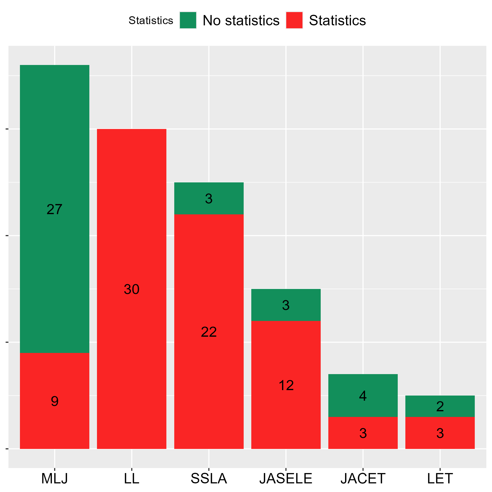

## Note

- ベイズの結果と頻度統計の結果が同じ値でも違う解釈になる理由やなぜベイズがはやっていないのかに関しての背景を異端の統計学ベイズから出してくる

# はじめに{background="#1F4E79"}

## 自己紹介 
- 寺井雅人（Masato Terai）

    - 熊本県菊池市出身

- 外国語習得や言語理解に関する研究がメイン。統計学そのものを研究しているわけではない。

## 発表しようと思ったきっかけ

- 統計学の講義を担当するようになった

  - 「教育面」への関心が高まった

## 補足

- 分析の方法やその解釈の仕方については触れません

- 「広がらない」の原因については、頻度統計もベイズ統計も手元のPCで実行できる環境があるにもかかわらず、今だに頻度統計が圧倒的に多く利用されていないのはなぜかという前提です。

- 30分では話尽くせないので、残りはぜひビアとともに🍺🍺

## 今回の内容
1. ベイズ統計学の利用があまり広がらない背景の考察

2. 統計教育への提案

::: callout-warning
個人的に「外国語教育研究はベイズ統計学を採用しなければならない」と思ってはいません。頻度主義統計学が元にしている理論は数学的にものすごく美しいです。問題だと思っているのは、頻度主義統計学を採用した研究が圧倒的に多いというアプローチの非対称性です。
:::

# 1. ベイズ統計学の利用があまり広がらない背景の考察{background="#1F4E79"}

## 外国語教育研究の実態調査

- 国内外の学術誌（最新の巻のみを対象、2026年9月24日現在）

- Research Article、Original Articleセクションに掲載の論文のみを対象

  - 外国語教育メディア学会機関誌（2025年62巻） 

  - JASELE Journal（2026年37巻）

  - JACET Journal（2025年69巻）

  - Language Learning (2026年76巻1～3号)

  - Studies in Second Language Acquisition (2026年48巻S1～3号)

  - Modern Language Journal (2026年110巻S1～3号)

## 外国語教育研究の実態調査

## 外国語教育研究の実態調査

## 原因（１）：ベイズ統計学の方が難しいという偏見

- 頻度主義統計学も難しいし、むしろ誤った使い方はこちらの方が起こしやすい

> 統計学者が使うことを念頭に、漸近論という理想状態をベースに考えているからである。現実のデータは理想状態から遠いことを考えると、理想状態から離れている要素を（非統計学者が）考えながらベストな統計分析を行うより、最初から現実のデータを出発点として考えることがフールプルーフに近いと言えるだろう。 - [ベイズ統計学と再現性の危機（テンプル大学統計科学部助教授：マクリン謙一郎） #心理統計を探検する](https://www.note.kanekoshobo.co.jp/n/nf836d37b7f10#1d2225c6-0445-4209-be27-7d1f0e65d8a4)

##  原因（１）：ベイズ統計学の方が難しいという偏見

- 「統計に詳しくないとベイズ統計はできない」はむしろ逆？

  - どちらかと言えば、ある程度のプログラミングの技能がないとベイズ統計は難しい

    - 近年では様々なツールでハードルは下がってきている（e.g., BayesRTMB）

- 分析者が決めることが多いのは事実（事前分布など）

- 院生になったばかりのころは、統計が得意な人が「ベイズ使いましょう」と言っていたのもあって、統計が得意でないと使っちゃいけないと勘違いしていた。

##  原因（２）：そもそもインプットが少ない

- 先行研究はそのほとんどが頻度主義統計学の枠組み

  - 年間で2コマしかない場合、教えられる内容がかぎられてしまう

  
## こんな人にお勧めかも（by 公式）
- [x] VS Codeにもう少しデータ分析専用の便利機能が欲しい

- [x] **RStudioをもっと自分好みにカスタマイズしたい**

- [x] Python や R だけでなく、JavaScriptなど他言語も使ってデータ分析やパッケージ開発をしている

- [x] データ分析に特化した強力な AI 機能を使いたい

# 2. 統計教育への提案 {background="#1F4E79"}

## 1. 頻度主義統計学がメインだとしてもベイズをコラムなどでねじ込む

- 回帰分析の回で、推定法の一つとして導入

  - 頻度主義：最尤法

  - ベイズ：MCMC法

- 『教育・心理系研究のためのＲによるデータ分析―論文作成への理論と実践集』

  - 「ベイズでやってみよう」セクション

## 2. 連続講座の開講

- １回のみだとかなり難しいので、複数回で構成される連続講座を実施（春や夏など）

  - 心理系：ベイズ塾

    - 毎年春に行われる数学勉強会など

  - 経済系：Nospare

## 3. 「外国語教育」の日本語のベイズの入門書を増やす

- 水本先生・竹内先生の『外国語教育ハンドブック』

- 平井先生・草薙先生・岡先生の『教育・心理系研究のためのＲによるデータ分析―論文作成への理論と実践集』

## 3. 「外国語教育」の日本語のベイズの入門書を増やす

- 他分野まで広げれば様々な入門書がある

  - 原『ベイズ統計　入門講義』

- 言語のトピックを例に書かれているとわかりやすいと思う

# まとめ{background="#1F4E79"}

# 参考資料{background="#1F4E79"}
- 💻：ウェブサイト

## 英語
- 💻Positron

    - [https://positron.posit.co](https://positron.posit.co)

## 日本語

- 💻【AI全部載せできるRのデータ分析環境はこれ】Positron Assistantの導入ガイド

## {background-image="title_image.png" background-repeat="no-repeat"}
