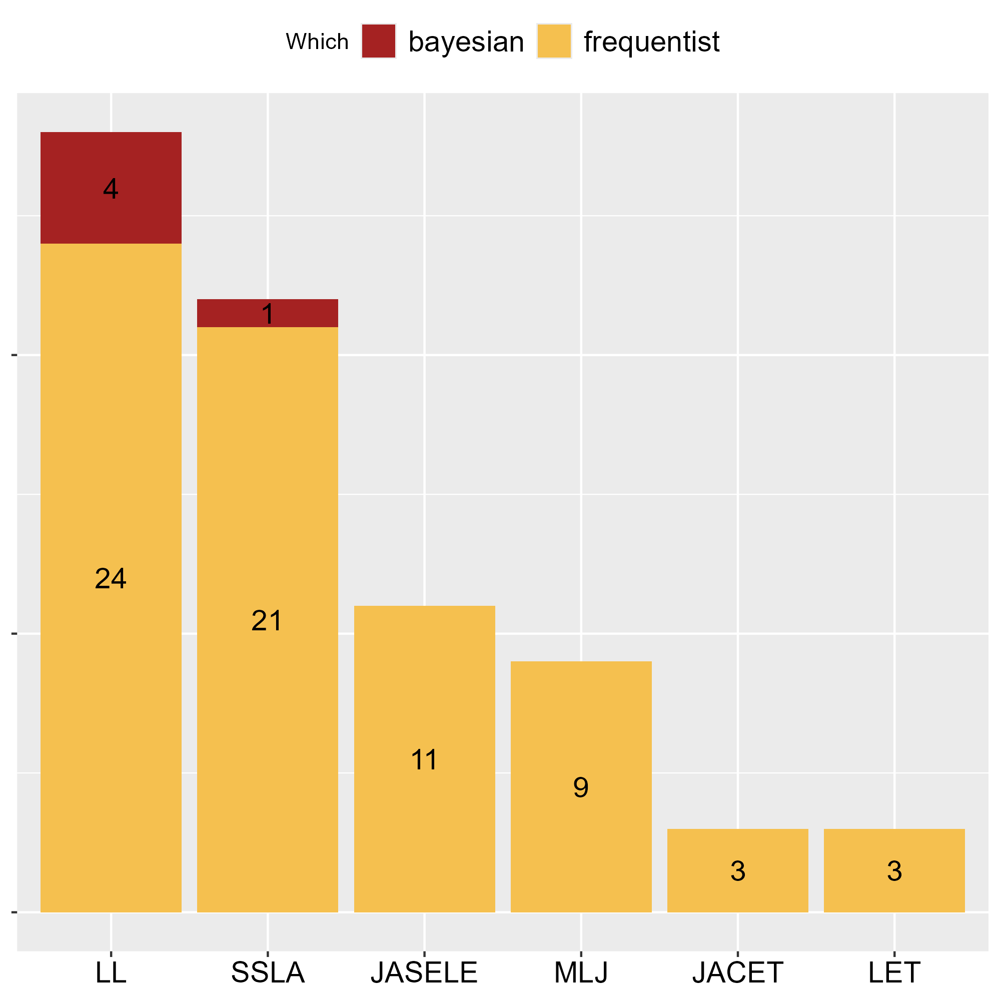
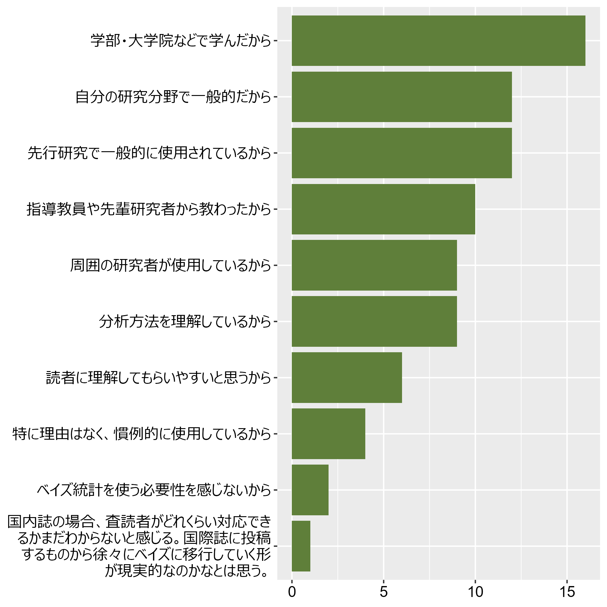
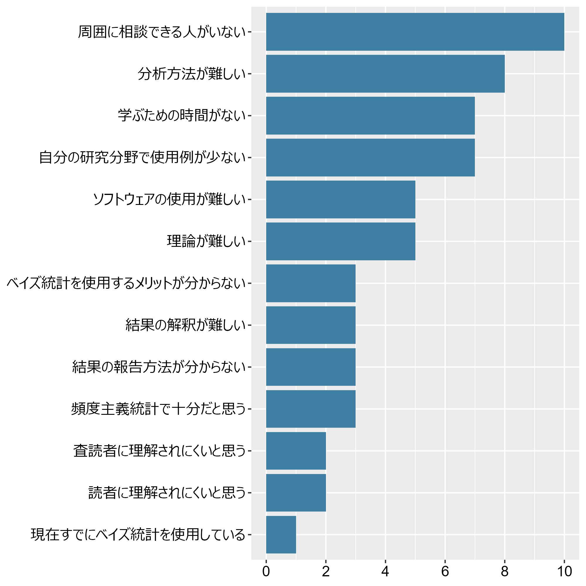
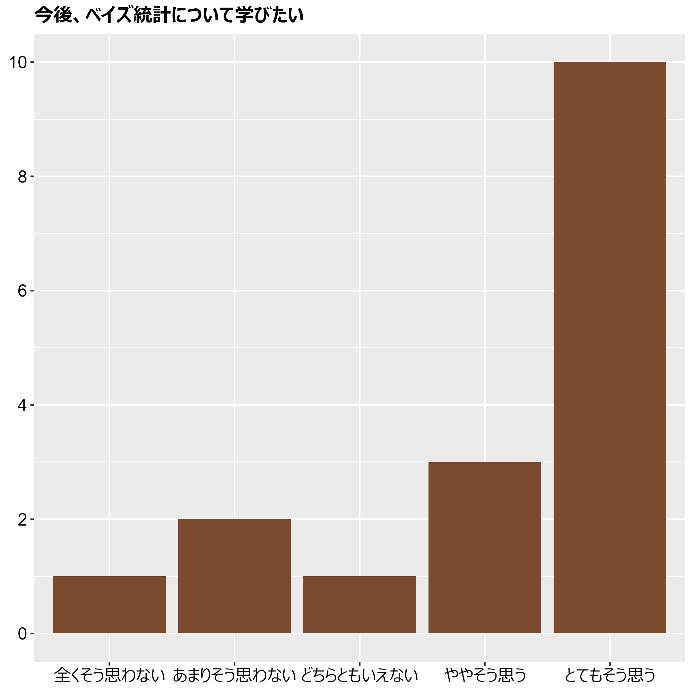
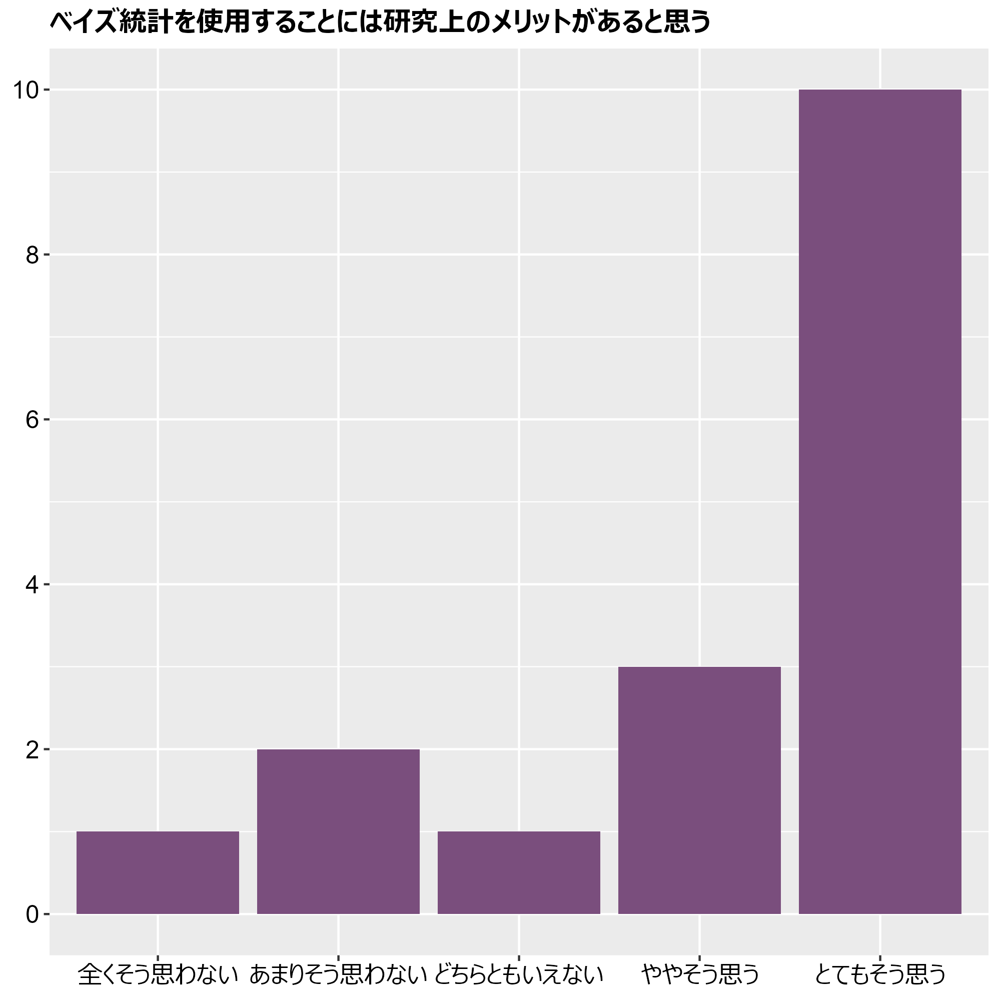

# はじめに{background="#7A4E7D"}

## 自己紹介 
- 寺井雅人（Masato Terai）

    - 熊本県菊池市出身

- 外国語習得や言語理解に関する研究がメイン。統計学そのものを研究しているわけではない。

## 発表しようと思ったきっかけ

- 統計学の講義を担当するようになった

  - 「教育面」への関心が高まった

## 補足

- 分析や解釈の方法については触れません

- 「広がらない」の原因については、頻度統計もベイズ統計も手元のPCで実行できる環境があるにもかかわらず、今だに頻度統計が圧倒的に多く利用されていないのはなぜかという前提です。

- 30分では話尽くせないので、残りはぜひビアとともに🍺🍺

## 今回の内容
1. ベイズ統計学の利用があまり広がらない背景の考察

2. 統計教育への提案

::: callout-warning
個人的に「外国語教育研究はベイズ統計学を採用しなければならない」と思ってはいません。頻度主義統計学が元にしている理論は数学的にものすごく美しいです。問題だと思っているのは、頻度主義統計学を採用した研究が圧倒的に多いというアプローチの非対称性です。
:::

# 1. ベイズ統計学の利用があまり広がらない背景の考察{background="#7A4E7D"}

# 実態調査

## 文献調査
- 国内外の学術誌（最新の巻のみを対象、2026年9月24日現在）

- Research Article、Original Articleセクションに掲載の論文のみを対象

  - 外国語教育メディア学会機関誌（2025年62巻） 

  - JASELE Journal（2026年37巻）

  - JACET Journal（2025年69巻）

  - Language Learning (2026年76巻1～3号)

  - Studies in Second Language Acquisition (2026年48巻S1～3号)

  - Modern Language Journal (2026年110巻S1～3号)

## 文献調査

## 文献調査

## アンケート調査
- 言語系の研究者を対象にアンケート調査（ *N* = 17 ）

  - M 生（*n* = 3）、D 生（*n* = 7）、大学・研究機関の研究者（*n* = 7）

## アンケート調査

> 研究で頻度主義統計（p値をもとに仮説検証を行う）を使用した経験がありますか。

  - はい（*n* = 17）

## アンケート調査
> 頻度主義統計学で分析する理由（複数選択）

## アンケート調査

> 研究でベイズ統計を使用した経験がありますか。

  - はい（*n* = 2）、いいえ（*n* = 14）、試しに触ってみた（*n* = 1）

## アンケート調査
> ベイズ統計を使用しない、または使用する機会が少ない理由（複数選択）

## アンケート調査

## アンケート調査

## まとめると...

- 国内外の外国語教育・第二言語習得系の学術誌では頻度主義統計学のアプローチによる研究が**圧倒的に**多い

::: incremental
- 国内の言語系の研究者のアンケートから、以下の原因が考えられる：

  1. 頻度主義統計学のインプットの方が多い

  2. ベイズ統計の方が難しいという先入観

  3. 読者・査読者が理解してくれないのではという不安
:::

# 2. 統計教育への提案 {background="#7A4E7D"}

## １．頻度主義統計学のインプットの方が多い

- 大学院から学び始める場合、教えられる内容が限られる

  - 大学院の講義だけの教育で考えると、**論文が読めるように**、**分析ができるように**、頻度主義統計学をメインで教えざるを得ない

  - 統計学に関する内容 + プログラミングについても触れる必要がある

## １．頻度主義統計学のインプットの方が多い

- 頻度主義統計学がメインだとしても、ベイズ統計学を少しでも教える

- 推定法の一つとして導入

  - 頻度主義：最尤法

  - ベイズ：MCMC法

::: callout-note
平井先生・草薙先生・岡先生：『教育・心理系研究のためのＲによるデータ分析―論文作成への理論と実践集』

  - 「ベイズでやってみよう」セクションなど
:::

## １．頻度主義統計学のインプットの方が多い

- 研究会、学会が連続講座の開講する

- ワンショットのワークショップだと参加者も講師も難しい

  - 心理学分野

    - 広島ベイズ塾、数学勉強会など

  - 第二言語習得分野

    - J-SLAの夏季セミナー

- 講座を通してコミュニティ形成のきっかけに

## １．頻度主義統計学のインプットの方が多い

- 徐々にベイズ統計を用いた論文は増えていくと考えられる。

  - 心理学系の国際誌に出した際に、ベイズ統計でないことでエディターキックになったことが数回ある。

##  2. ベイズ統計の方が難しいという先入観
- 頻度主義統計学の方が誤った使い方をした際に致命的な誤解に繋がりやすい

> 統計学者が使うことを念頭に、漸近論という理想状態をベースに考えているからである。現実のデータは理想状態から遠いことを考えると、理想状態から離れている要素を（非統計学者が）考えながらベストな統計分析を行うより、最初から現実のデータを出発点として考えることがフールプルーフに近いと言えるだろう。 - [ベイズ統計学と再現性の危機（テンプル大学統計科学部助教授：マクリン謙一郎） #心理統計を探検する](https://www.note.kanekoshobo.co.jp/n/nf836d37b7f10#1d2225c6-0445-4209-be27-7d1f0e65d8a4)

##  2. ベイズ統計の方が難しいという先入観

- 帰無仮説、95%信頼区間など、直感に合わない！

  - 例えば、95%信頼区間は「母集団からの無作為抽出と区間の算出という操作を無限回繰り返したとした場合、95%の割合で真の母数の値を含むことになるように構成された区間」

::: callout-caution
論文等で報告される95%信頼区間は、**データを得た後には上下限が固定された実数値**。一方、実際に得られた区間については、母数が「入っている」か「入っていない」かのどちらかであり、**「この区間内に母数がたぶんあるかも！しらんけど」**くらいの意味合いしか持てない。

$$
P_{\mu}\left(L(X) \leq \mu \leq U(X)\right)=0.95
$$
:::

##  2. ベイズ統計の方が難しいという先入観

- 以下の壁はAIの登場で少しずつ下がっていくはず

  - 分析者が取捨選択するプロセスはベイズ統計の方が多い（e.g., 事前分布、収束診断）

  - プログラミングのハードルの高さ

::: callout-note
院生になったばかりのころは、統計が得意な人が「ベイズ使いましょう」と言っていたのもあって、統計が得意でないと使っちゃいけないと勘違いしていた。  
:::

## 3. 読者・査読者が理解してくれないのではという不安

- 字数が限られている学会誌など、詳しく手法自体を説明するのが物理的に難しい

  - 分野全体で原因（１）、原因（２）を解決すればこの問題は解決。

# まとめ{background="#7A4E7D"}

- 外国語教育分野の国内外の採択された論文において、頻度主義統計学の手法がベイズ統計学に比べ圧倒的に多い。

- その理由として、頻度主義統計学を扱わざるを得ない状況が挙げられる。

- 解決策として、講義レベルでの工夫、分野全体での工夫などが挙げられる。

# {background-image="fig/title_image.png" background-repeat="no-repeat"}
